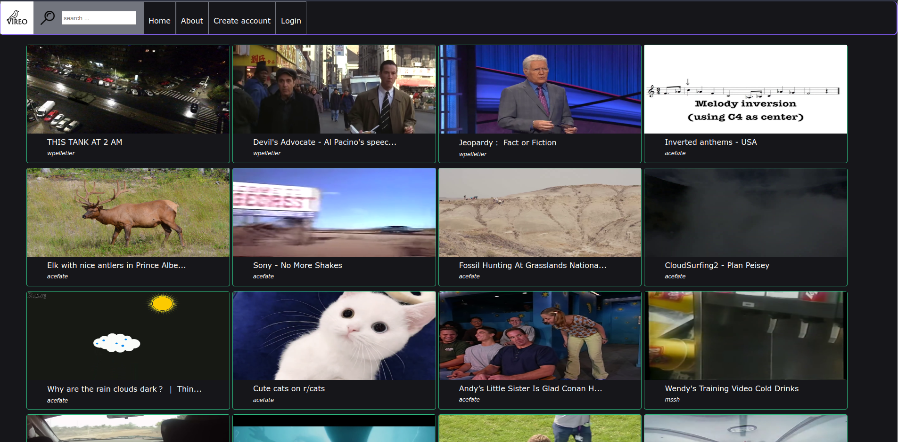
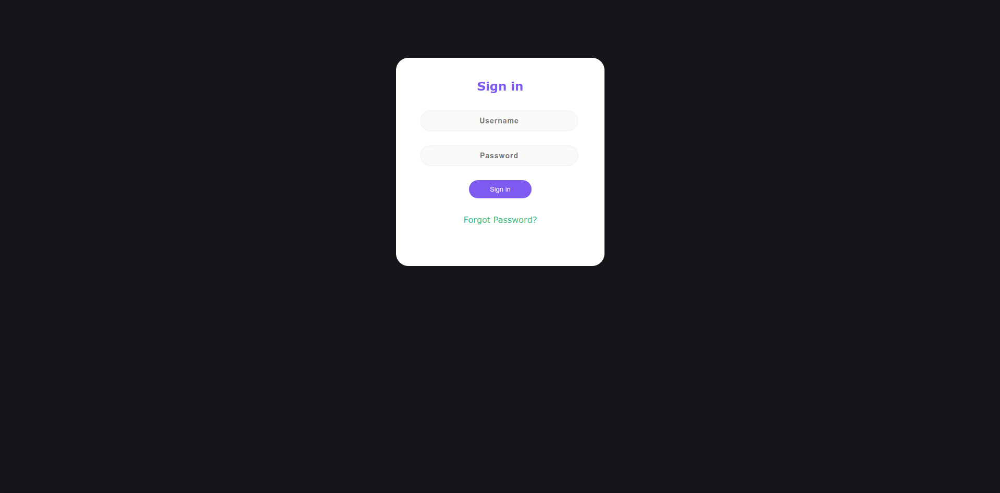

# vireo-client

## Description 
A simple graphic user interface website for the Vireo in JavaScript. It uses the Reactjs framework 

## TODO

- [ ] redesign the top bar
    - [ ] centering the logo
    - [ ] add dropdown menu in the left
    - [ ] set the channel button with the picture of the profile
- [ ] commenting code
